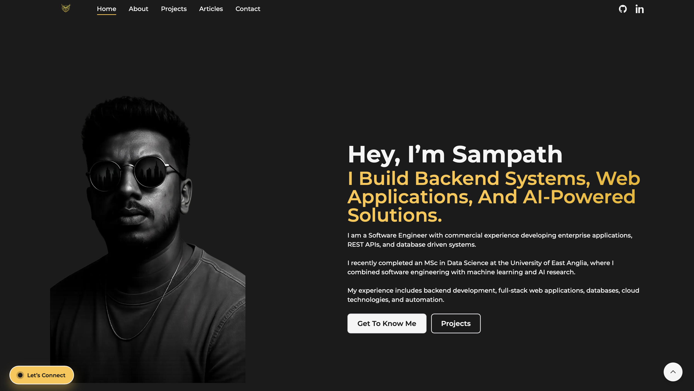

# Sampath Weerasekara | Portfolio Website



A modern personal portfolio website built with Next.js, showcasing my experience, projects, research, and technical articles in Software Engineering, Artificial Intelligence, and Data Science.

---

## About

I am a **Software Engineer and AI Developer** with experience building backend systems, web applications, machine learning solutions, and data-driven applications.

This portfolio serves as a central hub for my professional work, featuring software projects, AI research, technical writing, and career experience.

---

## Features

- Modern responsive design
- Dark mode interface
- Professional project showcase
- Technical articles and publications
- Interactive experience timeline
- Skills and technology overview
- Contact form integration
- Smooth animations with Framer Motion
- Mobile-first design
- Optimized performance

---

## Tech Stack

### Frontend

- Next.js
- React
- Tailwind CSS
- Framer Motion

### Development Tools

- Git
- GitHub
- Vercel

---

## Featured Projects

### WMFT AI Assessment System

Research project focused on automating Wolf Motor Function Test task detection and scoring using Vision Language Models (Qwen-VL) for stroke rehabilitation assessment.

### House Price Prediction

Machine learning application for predicting residential property prices using data preprocessing, feature engineering, and regression models.

### Customer Churn Prediction

Predictive analytics project for identifying customers at risk of leaving using machine learning classification techniques.

### Data Job Market Analytics

Interactive analytics dashboard exploring global trends, salaries, technologies, and opportunities within the data industry.

---

## Getting Started

### Clone the repository

```bash
git clone https://github.com/Ruchitha98/Sampath-Weerasekara-Portfolio.git
```

### Install dependencies

```bash
yarn install
```

### Run development server

```bash
yarn dev
```

### Build for production

```bash
yarn build
```

---

## Connect With Me

- LinkedIn: https://www.linkedin.com/in/ruchitha-18/
- GitHub: https://github.com/Ruchitha98
- Medium: https://medium.com/@rssampath21

---

## License

This project is licensed under the MIT License.

---

Built and maintained by **Sampath Weerasekara**.